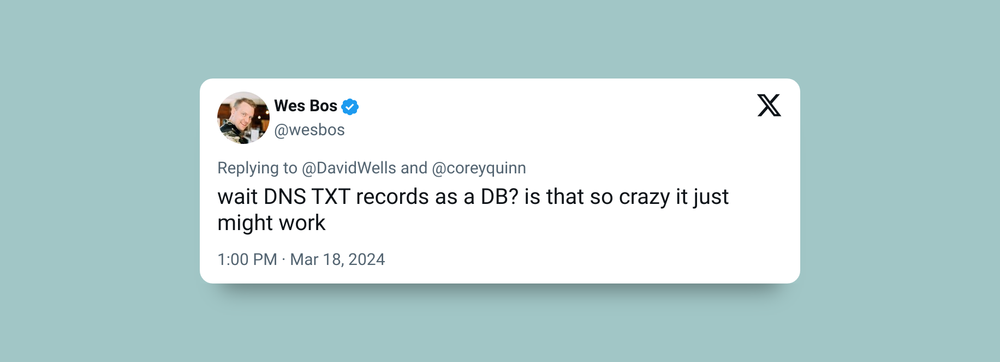
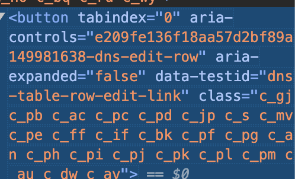

# Why?


https://twitter.com/wesbos/status/1769770742273417590

# Setup

`pnpm i` or `npm i`

This project uses Sveltekit and PicoCSS for css.

Cloudflare wrapper for interacting with DNS records.

# env variables

```
CF_API_TOKEN
CF_ZONE_ID
CLOUDFLARE_API_KEY
CLOUDFLARE_EMAIL
DNS_TXT_RECORD_ID
```

Create your new TXT record with a name of your choice, I have hardcoded to `notodo` see `+page.server.ts` under `actions`.

Obtaining TXT record id 

### Noob way

Use dev tools -> inspect the edit button look for the `aria-controls` attribute just remove `-dns-edit-row`



### Hackerman way

```ts
    const recordsList = await cloudflare.dns.records.list({
		zone_id: CF_ZONE_ID
	});
 	recordsList.result.filter((e) => {
		if (e.type === 'TXT') console.log({ name: e.name, id: e.id });
	}); // find your record and id
     
```